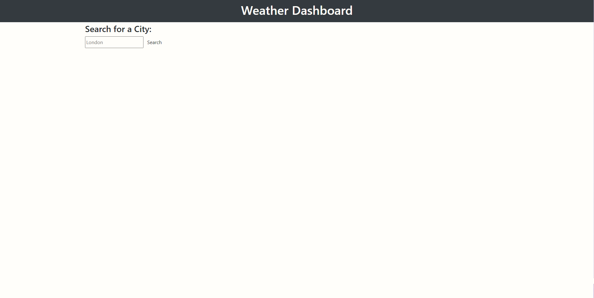

# Weather Dashboard

## Overview
 
This is an app that (theoretically, as it is broken) allows the user to see the weather forecast for cities of their choosing. It uses a server API, which retrieves data from another OpenWeatherMap. This repo is for my fourth weekly challenge, I made this using Javascript. In this challenge, I studied and applied all of the skills I have previously learned, alongside my newfound knowledge of advanced JS and implementing APis.

## Usage

The following image shows the web application's appearance and functionality:

And here is a link to the web application: https://mamaspaspa.github.io/Weather-Dashboard/

## Credits

Referenced: The in-class mini challenges from the past week, w3 School's, 'JavaScript Array concat()', and 'Introducing JavaScript objects' and tutor support. I also received in depth help from a friend.

## License

Refer to the license outlined in this repo.
